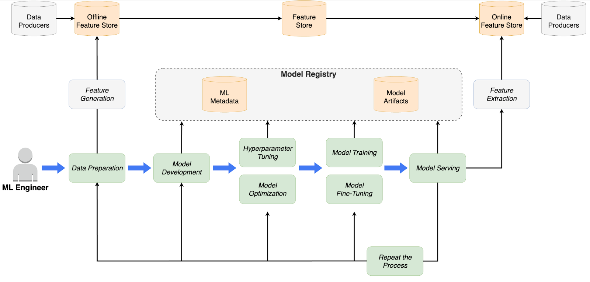

# Kubeflow 

**Kubeflow** is a specialized platform that supports the entire lifecycle of machine learning workflows on Kubernetes. Designed to simplify the management of complex AI/ML pipelines, Kubeflow integrates seamlessly with Kubernetes and offers features like distributed training, hyperparameter tuning through Katib, and model serving via KServe. 

Kubeflow’s deep integration with Kubernetes ensures efficient resource management, particularly for GPU workloads, making it ideal for AI-heavy applications that require extensive computational power.

