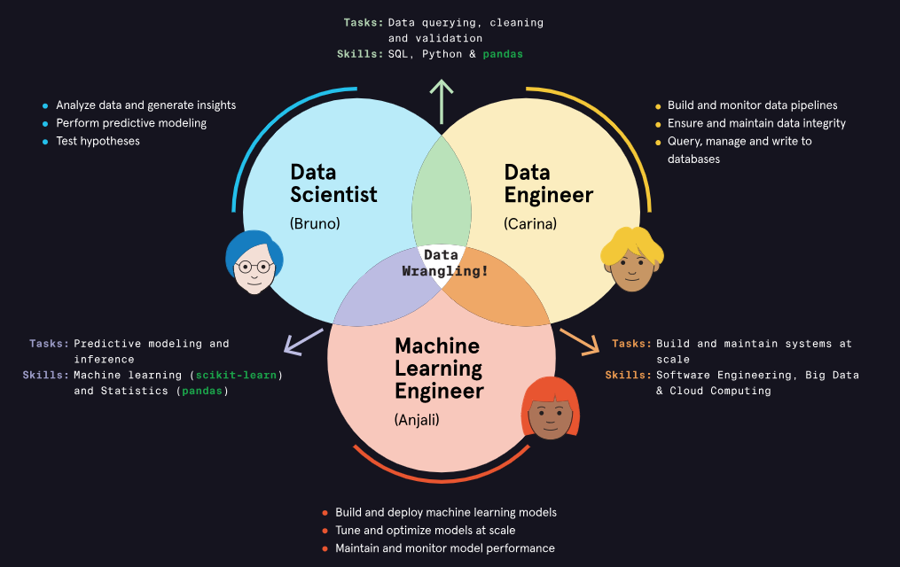

# Machine Learning Engineer 

The decision-making systems in our world are increasingly reliant on algorithmic thinking. Machine learning engineering is key to implementing these algorithms and automating the prediction process.

### What is Machine Learning? 

**Machine Learning (ML)** is a branch of **Artificial Intelligence (AI)** that allows systems to learn from data and make predictions or decisions **without being explicitly programmed**.  

## Key Components
- **Mathematics**: Probability, Linear Algebra, and Calculus form the foundation of models.  
- **Computer Science**: Programming languages implement these models into executable tasks.  
- **Statistics**: Ensures models reflect data accurately and helps evaluate their performance.  

## How It Works
1. Train models with historical data.  
2. Evaluate performance using statistics.  
3. Adjust parameters if results are poor.  
4. Repeat the process iteratively (similar to human learning).  

1. Machine Learning is an **iterative process** of training, testing, and improving models to recognize patterns and make predictions—mimicking aspects of human learning.

2. The more training data we have, the better an **algorithm** can learn its patterns.

3. Storing and accessing vast amounts of data requires robust hardware and pipelines. And running a machine learning algorithm requires lots of computing power and an infrastructure that allows for a seamless flow of data between the different steps of the algorithm.

**Machine Learning Engineering** concerns itself with designing, building, maintaining and fine-tuning computational systems that can execute sophisticated machine learning algorithms on large amounts of data.

## Roles - MLE vs. DS vs. DE

